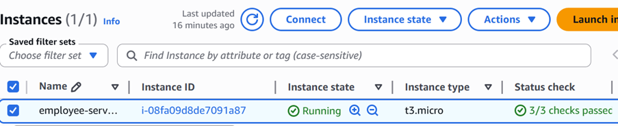
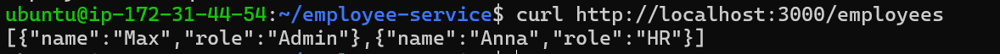
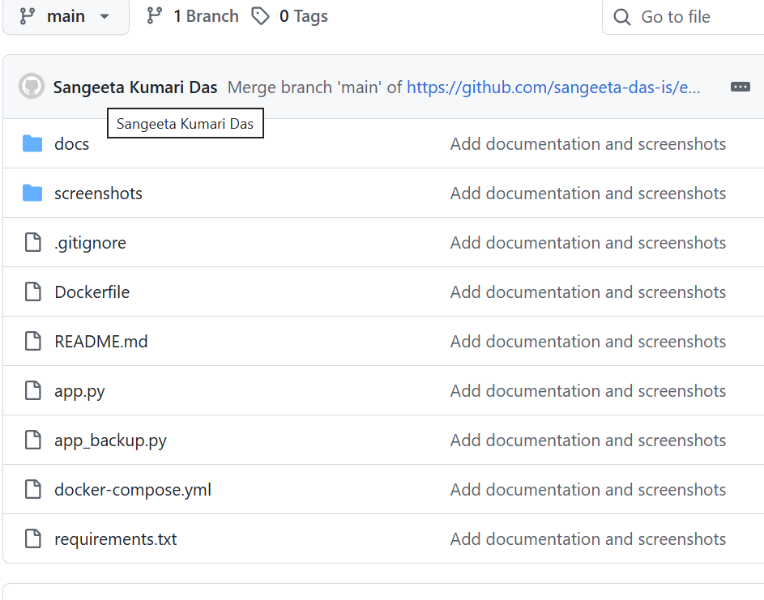

# Employee Service – Flask, PostgreSQL, Docker & AWS

## Projektübersicht

Dieses Projekt demonstriert die Entwicklung, Containerisierung und Bereitstellung einer REST-API mit Python Flask, PostgreSQL, Docker und AWS.

Die Anwendung stellt Mitarbeiterdaten über einen API-Endpunkt bereit und wurde vollständig auf einer AWS EC2-Instanz deployt.

---

## Verwendete Technologien

* Python Flask
* PostgreSQL 17
* Docker
* Docker Compose
* Git & GitHub
* AWS EC2
* Ubuntu 24.04 LTS
* SSH

---

## Projektarchitektur

```text
GitHub
   ↓
AWS EC2
   ↓
Docker Compose
   ├── Flask Container
   └── PostgreSQL Container
```

---

## API-Endpunkt

### Mitarbeiter abrufen

```http
GET /employees
```

### Beispielausgabe

```json
[
  {
    "name": "Max",
    "role": "Admin"
  },
  {
    "name": "Anna",
    "role": "HR"
  }
]
```

---

## Projektumfang

### Datenbank

* PostgreSQL-Datenbank eingerichtet
* Tabelle `employees` erstellt
* Testdaten eingefügt

### Backend

* REST-API mit Flask entwickelt
* PostgreSQL-Anbindung mit psycopg2
* JSON-Ausgabe implementiert

### Containerisierung

* Dockerfile erstellt
* Anwendung containerisiert
* Docker Compose für Multi-Container-Betrieb verwendet

### Versionsverwaltung

* Git Repository erstellt
* Projekt auf GitHub veröffentlicht

### Cloud Deployment

* AWS EC2 Instanz eingerichtet
* Docker und Docker Compose installiert
* Anwendung auf AWS bereitgestellt
* Öffentlichen Zugriff über Port 3000 ermöglicht

---

## Deployment-Test

Lokaler Test:

```bash
curl http://localhost:3000/employees
```

Öffentlicher Test:

```text
http://13.60.194.19:3000/employees
```

Ergebnis:

```json
[{"name":"Max","role":"Admin"},{"name":"Anna","role":"HR"}]
```

---

## Screenshots

### AWS EC2



### Öffentliche API



### GitHub Repository



---

## Projektdokumentation

Die vollständige technische Dokumentation befindet sich unter:

```text
docs/Dokumentation.md
```

---

## Projektziele erreicht

* REST-API mit Flask entwickelt
* PostgreSQL integriert
* Docker Container erstellt
* Docker Compose eingesetzt
* GitHub Repository erstellt
* AWS EC2 Deployment durchgeführt
* Anwendung öffentlich erreichbar gemacht

---

## Autor

Sangeeta Das

Fachinformatik – Systemintegration

GitHub:
https://github.com/sangeeta-das-is
